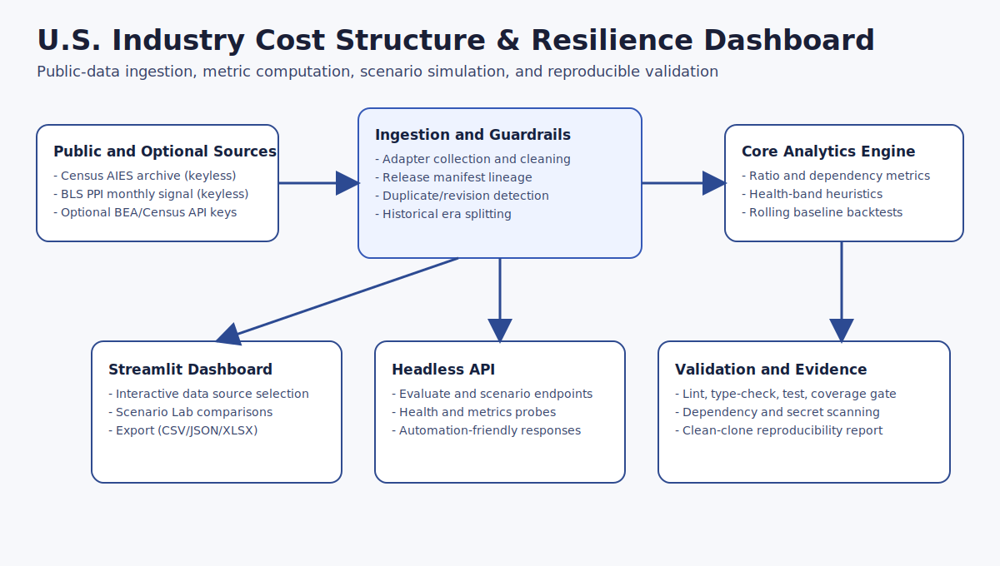

# U.S. Industry Cost Structure & Resilience Dashboard

This repository demonstrates practical economic and financial analysis engineering using U.S. government industry datasets. It provides an interactive Streamlit dashboard and a headless API for reproducible metric calculation, scenario comparison, and release-grade validation.

Problem addressed: compare industry input intensity and operating structure across sectors using transparent ratio-based metrics that can be recalculated under explicit scenario assumptions.

What the metric does: computes an informal cost-structure ratio (`gross_output / materials_cost`, or `gross_output / intermediate_inputs` when materials are unavailable) and related heuristic diagnostics.

What the metric does not mean: it is not a credit model, insolvency predictor, or causal macroeconomic forecast. Composite bands are heuristic summaries and must be interpreted with methodology limits.

## Demonstration

```bash
python -m venv .venv
.venv\Scripts\activate
pip install -r requirements.txt
streamlit run app.py
```

Open the local Streamlit URL and use the bundled sample dataset for an offline walkthrough. The same core service can be exercised through the API with `python src/scripts/run_api.py`.

Offline sample walkthrough command set:

```bash
python -m venv .venv
.venv\Scripts\activate
pip install -r requirements.txt -r requirements-dev.txt
streamlit run app.py
```

Primary offline source for demos: `data/sample_industries.csv`.

## Quick Start

Requires Python 3.13 or newer.

```bash
pip install -r requirements.txt
streamlit run app.py
```

Optional live government adapters use environment variables:

```bash
BEA_API_KEY=...
CENSUS_API_KEY=...
```

Public readiness commands for no-auth sources:

```bash
python src/scripts/public_data_readiness.py catalog --pretty
python src/scripts/public_data_readiness.py listen --dataset-id bls_ppi_monthly --storage-root build/public-smoke
python src/scripts/public_data_readiness.py backfill --dataset-id bls_ppi_monthly --start-year 2023 --end-year 2024 --storage-root build/public-smoke --dry-run --pretty
```

## Data Sources

Verified and implemented:

- Census AIES annual archive (keyless public files).
- BLS PPI monthly signal via public API series `PCU311111311111` (no key).
- Bundled offline sample dataset for local demonstration.

Optional environment-dependent integrations:

- BEA adapter and Census ASM adapter paths require configured API keys.

## Capability Status

Verified features:

- Streamlit dashboard for sample, official snapshot, and scenario exploration.
- Headless API for evaluation, scenario analysis, health, and metrics endpoints.
- Public-data readiness workflow (catalog, listener checks, backfill manifests, duplicate/revision guardrails).
- Rolling release-aware baseline backtest service.
- Structured export paths (CSV, JSON, XLSX).

Experimental capabilities:

- Composite health-style bands are heuristic and intended for comparative analysis only.

Roadmap-oriented catalog entries:

- Additional cataloged public sources may appear in the readiness catalog as planned entries without active ingestion implementations.

## Core Features

- Streamlit dashboard for sample, BEA, Census ASM, uploaded CSV, and official snapshot workflows.
- Headless API for evaluation, scenarios, analytics, metrics, and observability probes.
- Normalization and metric computation for `industry_code`, `industry_name`, `year`, `gross_output`, `materials_cost`, `intermediate_inputs`, and `value_added`.
- Scenario Lab recalculation for explicit percentage shocks.
- Public-data readiness catalog, release manifests, duplicate/revision guardrails, AIES backfill, BLS PPI monthly signal backfill, listener checks, and a naive rolling previous-period baseline.

## Methodology Limitations

- "Idiot Index" is an informal ratio: `gross_output / materials_cost` or `gross_output / intermediate_inputs` when materials are unavailable.
- Census AIES output uses a revenue-to-operating-expense proxy and is not the strict BEA gross-output-to-intermediate-inputs ratio.
- The composite score is experimental and heuristic. Several components are algebraic transformations of the same output/input relationship, so the bands do not independently prove industry health, resilience, or economic distress.
- Neutral composite bands are used: `lower_input_intensity`, `moderate_input_intensity`, `higher_input_intensity`, and `review_required`.
- GDELT and similar event feeds are contextual signals only and must not be treated as economic ground truth.

## Data Provenance

Implemented public readiness sources:

- Census AIES annual archive: keyless Census ZIP files, cleaned into the existing annual industry proxy schema.
- BLS PPI monthly signal: no-key BLS public API series `PCU311111311111`, mapped only to documented NAICS `311111` from the embedded PCU industry code.

Cataloged roadmap sources are not automatically implemented or verified. Check implementation status with:

```bash
python src/scripts/public_data_readiness.py catalog --pretty
```

Backfill outputs are designed for local or external storage and should not be committed when large:

```text
data/public/
  raw/<dataset_id>/<release_id>/
  cleaned/<dataset_id>/<release_id>/
  manifests/<dataset_id>/<release_id>.json
```

## Visual Evidence

Release visuals are stored under `assets/public-release/`.

Dashboard overview (sample-data capable interface):


Scenario Lab comparison view:


Architecture and data flow:



## Architecture Summary

```text
adapters/public sources -> core normalization + metrics -> application services
                                                     |-> Streamlit UI
                                                     |-> headless API
                                                     |-> scripts and agent wrappers
```

Key modules:

- [src](src/README.md) for normalization, metrics, analytics, cache, and public-data manifest primitives.
- [src/adapters](src/adapters) for source-specific data access.
- [src/application](src/application) for orchestration, scenarios, public backfill, and rolling backtests.
- [src/interfaces](src/interfaces) for Streamlit and API surfaces.
- [src/scripts](src/scripts/README.md) for operator and validation commands.

## Verification Evidence

Primary local validation commands:

```bash
python -m black --check app.py src tests
python -m ruff check app.py src tests
python -m mypy src
python -m pytest -q
python src/scripts/run_quality_checks.py --fast
git diff --check
```

Security and coverage gates are documented in [docs/PUBLIC_RELEASE_VALIDATION.md](docs/PUBLIC_RELEASE_VALIDATION.md) and should be run where `pip-audit`, `detect-secrets`, and `pytest-cov` are installed. Current branch validation should be checked in the pull request report, not inferred from this README.

Most recent validated clean-clone totals are recorded in [docs/PUBLIC_RELEASE_VALIDATION.md](docs/PUBLIC_RELEASE_VALIDATION.md), including full test count and runtime coverage gate result.

GitHub Actions status: repository Actions are currently disabled by owner policy, so local clean-clone validation is the authoritative release gate.

## Documentation

- [Data dictionary](docs/DATA_DICTIONARY.md)
- [Public data refresh workflow](docs/WORKFLOWS_DATA_REFRESH.md)
- [Analytics methodology](docs/ANALYTICS_HEALTH.md)
- [API reference](docs/API_REFERENCE.md)
- [Headless API guide](docs/API_HEADLESS.md)
- [Architecture overview](docs/ARCHITECTURE_OVERVIEW.md)
- [Operations incident response](docs/OPERATIONS_INCIDENT_RESPONSE.md)
- [Dependency register](docs/DEPENDENCIES.md)

## Governance and Support

- [License](LICENSE)
- [Code of Conduct](docs/CODE_OF_CONDUCT.md)
- [Contributing guide](docs/CONTRIBUTING.md)
- [Security and incident response](docs/OPERATIONS_INCIDENT_RESPONSE.md)
- [Data-source attribution and dependencies](docs/DEPENDENCIES.md)
- [Industry shock case study](docs/INDUSTRY_SHOCK_CASE_STUDY.md)

## Docker

```bash
docker build -t industry-resilience-dashboard .
docker run -p 8501:8501 industry-resilience-dashboard
docker run -e APP_MODE=api -p 9000:9000 industry-resilience-dashboard
```

The image uses Python 3.13 and runtime dependencies only. Docker validation status belongs in the branch or release report because it depends on local Docker availability.

## License

Apache License 2.0. See [LICENSE](LICENSE).
