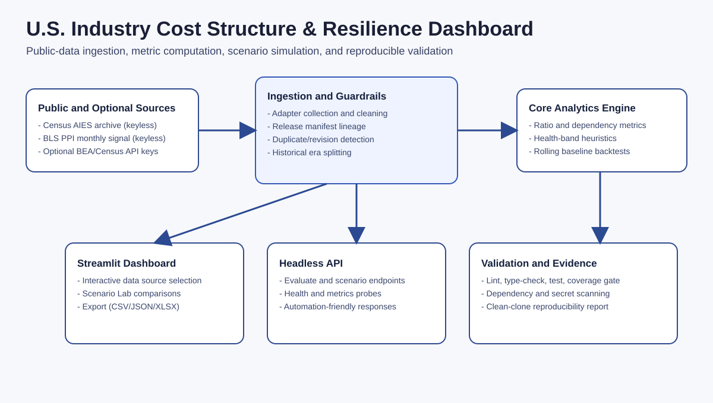

# U.S. Industry Cost Structure & Resilience Dashboard

> **Status: v0.3.0 PUBLIC BETA** — Industry Pulse is published as the `v0.3.0` GitHub prerelease after exact-head CI, Docker validation, and Windows/Microsoft Edge acceptance. The analytical metrics remain experimental and should not be treated as financial, investment, credit, or policy advice.

The draft `v0.4.0 Industry Momentum` workstream adds reviewed BLS CES employment and Federal
Reserve G.17 production, capacity, and utilization context. It does not change the published
package version or Public Beta status and is not yet a release.

Published `v0.3.0` evidence is tracked in [issue #113](https://github.com/Nobodyworld/app-industry-resilience/issues/113), the [`v0.3.0` execution plan](docs/execplans/v0.3.0-industry-pulse.md), the [`v0.3.0` release notes](docs/RELEASE_NOTES_V0.3.0.md), and the [publication parity record](docs/execplans/v0.3.0-publication-record.md). The GitHub release is available at [`v0.3.0 Public Beta — Industry Pulse`](https://github.com/Nobodyworld/app-industry-resilience/releases/tag/v0.3.0).

This repository demonstrates practical economic and financial analysis engineering using U.S. government industry datasets. It provides an interactive Streamlit dashboard and a headless API for reproducible metric calculation, scenario comparison, and release-grade validation.

Problem addressed: compare industry input intensity and operating structure across sectors using transparent ratio-based metrics that can be recalculated under explicit scenario assumptions.

What the metric does: computes an informal cost-structure ratio (`gross_output / materials_cost`, or `gross_output / intermediate_inputs` when materials are unavailable) and related heuristic diagnostics.

What the metric does not mean: it is not a credit model, insolvency predictor, or causal macroeconomic forecast. Composite bands are heuristic summaries and must be interpreted with methodology limits.

## Quick Start

Requires Python 3.13 or newer. Create a virtual environment and install dependencies.

### Windows PowerShell

```powershell
python -m venv .venv
.venv\Scripts\activate
pip install -r requirements.txt
streamlit run app.py
```

### macOS/Linux Bash

```bash
python -m venv .venv
source .venv/bin/activate
pip install -r requirements.txt
streamlit run app.py
```

On first run, the dashboard opens with **Sample (offline)**, the bundled no-credential dataset. Choose another option from **Data source** only when you need a different dataset. The same core service can be exercised through the API with `python src/scripts/run_api.py`.

Suggested walkthrough in the UI:

1. Confirm source and reference year in the left Data Studio panel.
2. Use the top tabs in order: Overview, Explore, Compare, Scenario Lab, then Industry Momentum.
3. In Scenario Lab, set at least one non-zero adjustment, click Run scenario, then use Reset scenario to return to idle state.
4. Open **Data provenance** to verify source identity, vintage, cache state, and transformations.
5. Open **Industry Momentum** to inspect exact/broader mapping availability or clearly labeled
   manual browsing across Prices, Employment, and Production & Capacity, with monthly history,
   freshness, tables, provenance, and signal-only CSV/JSON/XLSX downloads. Enable the optional
   custom history window to limit only this contextual display and those signal-only downloads;
   annual analysis, comparisons, Scenario Lab, scores, bands, and lineage remain unchanged.
6. Use the annual export panel for all-rows vs current-view outputs in CSV, JSON, or XLSX.

Primary offline source for demos: `data/sample_industries.csv`.

Optional live government adapters use environment variables:

```bash
BEA_API_KEY=...
CENSUS_API_KEY=...
```

Public readiness commands for no-auth sources:

```bash
python src/scripts/public_data_readiness.py catalog --pretty
python src/scripts/public_data_readiness.py listen --dataset-id bls_ppi_monthly --storage-root build/public-smoke
python src/scripts/public_data_readiness.py backfill --dataset-id bls_ppi_monthly --start-year 2023 --end-year 2024 --storage-root build/public-smoke --dry-run --pretty
```

The same validated no-auth readiness catalog is available to API clients at:

```bash
curl http://localhost:9000/v1/meta/public-data
curl http://localhost:9000/v1/context/signals
curl http://localhost:9000/v1/context/momentum
curl "http://localhost:9000/v1/context/momentum/325211?source_family=fed_g17&limit=24"
```

## Data Sources

Verified and implemented:

- Census AIES annual archive (keyless public files).
- BLS PPI monthly context for eight reviewed whole-industry series, delivered from the
  committed no-key offline snapshot. The bounded snapshot contains January 2024 through
  June 2026 and is generated by one batched official BLS request.
- BLS CES monthly employment for eight reviewed series and Federal Reserve G.17 monthly
  production/capacity context for 22 reviewed series, delivered from committed offline snapshots.
- Bundled offline sample dataset for local demonstration.

Optional environment-dependent integrations:

- BEA adapter and Census ASM adapter paths require configured API keys and are intentionally excluded from the no-auth public-data readiness catalog.

## Capability Status

Verified features:

- Streamlit dashboard for sample, official snapshot, and scenario exploration.
- Headless API for evaluation, scenario analysis, health, and metrics endpoints.
- Public-data readiness workflow (catalog, listener checks, backfill manifests, duplicate/revision guardrails).
- Rolling release-aware baseline backtest service.
- Typed, privacy-safe provenance in the dashboard, API, caches, scenarios, and exports.
- Structured export paths (CSV, JSON, XLSX, plus CSV lineage companions).
- First-class Industry Momentum tab with exact/broader mapping, explicit partial/unmapped/manual
  states, a user-selectable contextual history window, separate signal charts and tables,
  current/stale disclosure, and separate provenance.

Experimental capabilities:

- Composite health-style bands are heuristic and intended for comparative analysis only.

Roadmap-oriented catalog entries:

- Additional cataloged public sources may appear in the readiness catalog as planned entries without active ingestion implementations.

## Core Features

- Streamlit dashboard for sample, BEA, Census ASM, uploaded CSV, and official snapshot workflows, with a typed Data provenance panel.
- Headless API for evaluation, scenarios, analytics, metrics, and observability probes.
- Normalization and metric computation for `industry_code`, `industry_name`, `year`, `gross_output`, `materials_cost`, `intermediate_inputs`, and `value_added`.
- Scenario Lab recalculation for explicit percentage shocks.
- Public-data readiness catalog, release manifests, duplicate/revision guardrails, AIES backfill, BLS PPI monthly signal backfill, listener checks, and a naive rolling previous-period baseline.
- Canonical-only `GET /v1/context/signals` and
  `GET /v1/context/signals/{industry_code}` routes backed only by the reviewed snapshot.
- Canonical-only `GET /v1/context/momentum` and
  `GET /v1/context/momentum/{industry_code}` routes for the composing 38-series registry, bounded
  filters, per-family degradation, and no provider calls.

## Methodology Limitations

- "Idiot Index" is an informal ratio: `gross_output / materials_cost` or `gross_output / intermediate_inputs` when materials are unavailable.
- Census AIES output uses a revenue-to-operating-expense proxy and is not the strict BEA gross-output-to-intermediate-inputs ratio.
- The composite score is experimental and heuristic. Several components are algebraic transformations of the same output/input relationship, so the bands do not independently prove industry health, resilience, or economic distress.
- Neutral composite bands are used: `lower_input_intensity`, `moderate_input_intensity`, `higher_input_intensity`, and `review_required`.
- GDELT and similar event feeds are contextual signals only and must not be treated as economic ground truth.
- Industry Pulse PPI is producer-price context, not the annual output-to-cost ratio. PPI
  movement does not establish profitability, resilience, insolvency risk, or causation.
  Raw levels from series with different base dates must not be compared directly.
- CES employment and G.17 production/capacity observations are context only. Broader published
  scopes are not exact six-digit matches. Unlike units, percentages, and indexes with different
  base periods must not be compared directly. No source proves profitability, resilience,
  distress, insolvency, causation, or forecast performance.

## Data Provenance

Implemented public readiness sources:

- Census AIES annual archive: keyless Census ZIP files, cleaned into the existing annual industry proxy schema.
- BLS PPI Industry Pulse: eight no-key whole-industry series whose PCU industry and product
  segments both exactly match the registered six-digit NAICS code. The UI and API use a
  reviewed offline snapshot and never make provider calls during requests or rendering.
  Signal provenance, snapshot identity, and transformations remain separate from annual
  dataset lineage.
- BLS CES Industry Momentum: eight no-key employment series. Federal Reserve G.17 Industry
  Momentum: eight production and 14 capacity/utilization series. The shared public-data pipeline
  provides deterministic normalization, manifests, and complete registered-series fingerprints.

Cataloged roadmap sources are not automatically implemented or verified. Check implementation status with:

```bash
python src/scripts/public_data_readiness.py catalog --pretty
```

Backfill outputs are designed for local or external storage and should not be committed when large:

```text
data/public/
  raw/<dataset_id>/<release_id>/
  cleaned/<dataset_id>/<release_id>/
  manifests/<dataset_id>/<release_id>.json
```

## Visual Evidence

Release visuals are stored under `assets/public-release/`.

Dashboard overview (sample-data capable interface):


Scenario Lab comparison view:


Architecture and data flow:



## Architecture Summary

```text
adapters/public sources -> core normalization + metrics -> application services
                                                     |-> Streamlit UI
                                                     |-> headless API
                                                     |-> scripts and agent wrappers
```

Key modules:

- [src](src/README.md) for normalization, metrics, analytics, cache, and public-data manifest primitives.
- [src/adapters](src/adapters) for source-specific data access.
- [src/application](src/application) for orchestration, scenarios, public backfill, and rolling backtests.
- [src/interfaces](src/interfaces) for Streamlit and API surfaces.
- [src/scripts](src/scripts/README.md) for operator and validation commands.

## Verification Evidence

Primary local validation commands:

```bash
python -m black --check app.py src tests
python -m ruff check app.py src tests
python -m mypy src
python -m pytest -q
python src/scripts/run_quality_checks.py --fast
git diff --check
```

Security and coverage gates are documented in [docs/PUBLIC_RELEASE_VALIDATION.md](docs/PUBLIC_RELEASE_VALIDATION.md) and should be run where `pip-audit`, `detect-secrets`, and `pytest-cov` are installed. The `v0.3.0` protected and publication evidence is recorded in [issue #113](https://github.com/Nobodyworld/app-industry-resilience/issues/113) and the [publication record](docs/execplans/v0.3.0-publication-record.md).

Most recent clean-clone totals are recorded in [docs/PUBLIC_RELEASE_VALIDATION.md](docs/PUBLIC_RELEASE_VALIDATION.md). Current hosted evidence should be taken from the relevant pull request or Actions run rather than inferred from historical totals.

GitHub Actions policy: hosted CI is required for current pull requests and release candidates. Local clean-clone validation remains supporting evidence, but it does not replace a successful Actions run. All external action references must use approved repositories and be pinned to full-length commit SHAs. See [docs/CONTRIBUTING.md](docs/CONTRIBUTING.md) for contributor requirements.

## Documentation

- [v0.3.0 Industry Pulse validation and acceptance](docs/execplans/v0.3.0-industry-pulse.md)
- [v0.3.0 Public Beta release notes](docs/RELEASE_NOTES_V0.3.0.md)
- [v0.3.0 publication parity record](docs/execplans/v0.3.0-publication-record.md)
- [v0.2.0 release validation and acceptance](docs/execplans/v0.2.0-public-beta-release-candidate.md)
- [v0.2.0 Public Beta release notes](docs/RELEASE_NOTES_V0.2.0.md)
- [Data dictionary](docs/DATA_DICTIONARY.md)
- [Industry Pulse verified BLS registry](docs/INDUSTRY_PULSE_BLS_SERIES.md)
- [Public data refresh workflow](docs/WORKFLOWS_DATA_REFRESH.md)
- [Analytics methodology](docs/ANALYTICS_HEALTH.md)
- [API reference](docs/API_REFERENCE.md)
- [Headless API guide](docs/API_HEADLESS.md)
- [Architecture overview](docs/ARCHITECTURE_OVERVIEW.md)
- [Operations incident response](docs/OPERATIONS_INCIDENT_RESPONSE.md)
- [Dependency register](docs/DEPENDENCIES.md)
- [Public-beta accessibility audit](docs/ACCESSIBILITY_AUDIT.md)

## Governance and Support

- [License](LICENSE)
- [Code of Conduct](docs/CODE_OF_CONDUCT.md)
- [Contributing guide](docs/CONTRIBUTING.md)
- [Security policy](docs/handbook/SECURITY.md)
- [Operations incident response](docs/OPERATIONS_INCIDENT_RESPONSE.md)
- [Data-source attribution and dependencies](docs/DEPENDENCIES.md)
- [Industry shock case study](docs/INDUSTRY_SHOCK_CASE_STUDY.md)

## Docker

```bash
docker build -t industry-resilience-dashboard .
docker run -p 8501:8501 industry-resilience-dashboard
docker run -e APP_MODE=api -p 9000:9000 industry-resilience-dashboard
```

The image uses Python 3.13 and runtime dependencies only. The pinned, least-privilege [Docker Smoke workflow](.github/workflows/docker-smoke.yml) validates the production image, non-root runtime user, Streamlit health, API `/health`, and API `/metrics` on deployment-relevant changes. Published `v0.3.0` Docker evidence is recorded in [issue #113](https://github.com/Nobodyworld/app-industry-resilience/issues/113).

## License

Apache License 2.0. See [LICENSE](LICENSE).
